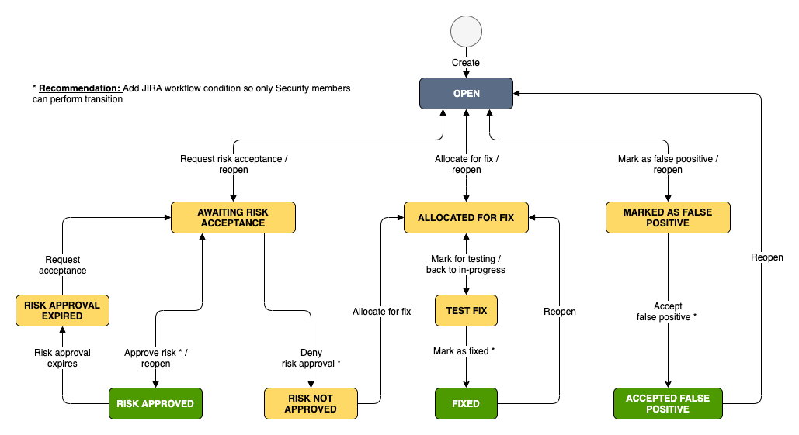
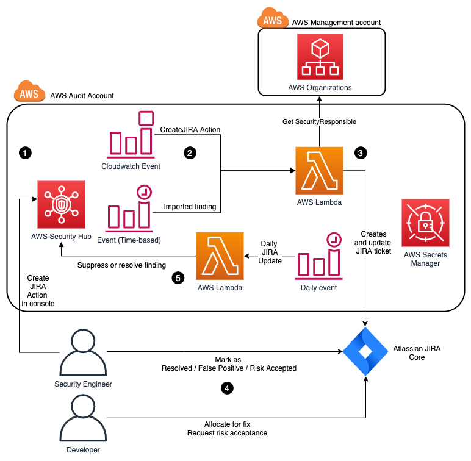

# Security Hub JIRA Integration

## Summary

This solution supports a bidirectional integration between Security Hub and JIRA. Issues can be either created automatically or manually by using custom actions.

## Description

The solution uses a custom JIRA workflow to reflect the risk management of each finding. Workflow is inspired by [DinisCruz SecDevOps risk workflow](https://www.slideshare.net/DinisCruz/secdevops-risk-workflow-v06).

The solution considers the following scenarios and perform the actions above:
* When Security Hub finding is created, if its control is covered by automation or a custom action triggered for that finding, then the integration:
    *  Creates a JIRA ticket
    *  Marks finding as NOTIFIED
    *  Adds a note with ticket ID
    *  Assigns ticket according to `SecurityContactID` account tag (read through Organization management account). If not found, uses the `DefaultAssignee`.
* When underlying finding are archived (i.e resolved), its related JIRA ticket is closed automatically.
* When JIRA ticket is transitioned as false positive or accepted risk, its related Security Hub finding is suppressed.
* When JIRA ticket is transitioned to closed, its Security Hub finding is resolved. 
* When the same finding reoccurs (same `FindingId`), its JIRA ticket is reopen.

## Architecture

## How to deploy?

### Prerequisites

* JIRA Server instance.
*Note*: JIRA Cloud is supported but JIRA workflow XML cannot be imported and needs to be recreated.
* JIRA Administrator permissions. 
* JIRA Username Personal Access Token (PAT) for JIRA Enterprise ([how to generate PAT tokens](https://confluence.atlassian.com/enterprise/using-personal-access-tokens-1026032365.html)) or JIRA API Token for JIRA Cloud ([how to generate API tokens](https://support.atlassian.com/atlassian-account/docs/manage-api-tokens-for-your-atlassian-account/)). 
* Cross account AWSOrganizationsReadOnlyAccess permissions to Organization management account. Required to retrieve Security Contact account tag. Alternatively, You can use default assignee to deploy without this permissions  
* Access to AWS Audit account to escalate findings across Organization. Alternatively you can use any account to escalate only Security findings from that account.

### Step 1: Configure

1. As JIRA Administrator, import `issue-workflow.xml` file to your JIRA Server instance. Check out [related documentation](https://confluence.atlassian.com/adminjiraserver/using-xml-to-create-a-workflow-938847525.html). 
2. Create a new issue type (or use an already existing type such as Bug) for the project and assign to the workflow scheme created above ([JIRA documentation](https://support.atlassian.com/jira-cloud-administration/docs/manage-issue-workflows/))
4. Modify `conf/params_prod.sh` with the following values:
    * ORG_ACCOUNT_ID: Account ID for Organization Management account. The solution assumes the role below to read account tags to assign ticket to the specific AWS account security contact.
    * ORG_ROLE: OrganizationsReadOnlyAccess. Name of the role assumed to AWS Organization management account.
    * EXTERNAL_ID: Optional parameters if using External Id to assume the role above. 
    * JIRA_DEFAULT_ASSIGNEE: This is the JIRA ID for default assignee for all Security Issues. This default assigned is used in case account is not tagged properly or role cannot be assumed.
    * JIRA_INSTANCE: HTTPS address for JIRA server. For example, https://team-1234567890123.atlassian.net/
    * JIRA_PROJECT_KEY: Name of the JIRA Project Key used to create tickets. This project needs to already exist in JIRA. Examples: "SEC", "TEST", etc. 
    * ISSUE_TYPE: JIRA Issuetype name: Examples would be "Bug", "Security Issue"
    * REGIONS:  List of regions where to deploy. Example: ("eu-west-1")

### Step 2: Deploy
1. Set AWS enviroment variables for credential, like AWS_SECRET_ACCESS_KEY, AWS_SECRET_ACCESS_KEY, AWS_REGION
2. Execute `./deploy.sh [prod]"
3. Upload your JIRA Credentials to `JIRA-Token` via AWS Secrets Manager console:
    * For JIRA Enterprise: Add `auth` as `token_auth` and for `token` add Personal Access Token (PAT)
    * For JIRA Cloud: Add `auth` as `basic_auth` and add both `email` and `token` fields of your integration user API token.
    
### Step 3: Including new automated controls

You can specify type of findings which are automated using `GeneratorId` field. You can choose different findings to automate per region. For example, selecting that `eu-west-1` region is the only region creating IAM related tickets. To add controls, add its `GeneratorId` under its `config.json`.    

## Security

See [CONTRIBUTING](CONTRIBUTING.md#security-issue-notifications) for more information.

## License

This library is licensed under the MIT-0 License. See the LICENSE file.

